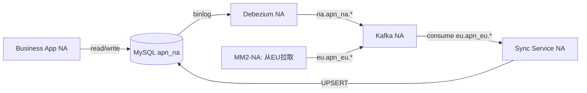
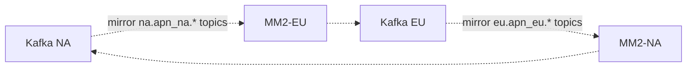
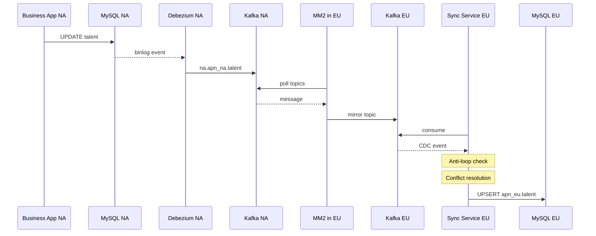
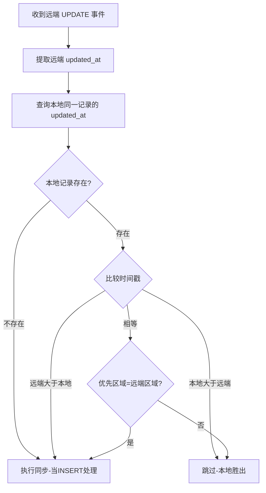
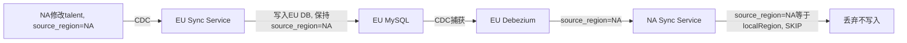

# NA - EU 跨区域数据双向同步

> 基于 Debezium CDC + Kafka + MirrorMaker 2 的实时数据同步方案
>
> Region Sync Service | 技术设计文档 | v1.0

---

## 目录

1. [项目背景与目标](#1-项目背景与目标)
2. [整体架构](#2-整体架构)
3. [组件清单与职责](#3-组件清单与职责)
4. [数据流详解](#4-数据流详解)
5. [MirrorMaker 2 跨区域镜像](#5-mirrormaker-2-跨区域镜像)
6. [冲突解决策略](#6-冲突解决策略)
7. [防回环机制](#7-防回环机制)
8. [同步表与配置](#8-同步表与配置)
9. [端口与服务映射](#9-端口与服务映射)
10. [运维与监控](#10-运维与监控)
11. [技术栈总览](#11-技术栈总览)
12. [生产部署架构](#12-生产部署架构)

---

## 1. 项目背景与目标

公司业务覆盖 **NA（北美）** 和 **EU（欧洲）** 两个区域，各区域独立部署数据库（MySQL）。为实现 **全球数据一致性**，需要将两个区域的核心业务数据进行 **准实时双向同步**。

### 核心目标

| 目标 | 说明 |
|------|------|
| 准实时同步 | 数据变更秒级到达对端区域，延迟 < 5 秒（网络正常时） |
| 双向同步 | NA 和 EU 任一侧的变更都能同步到对端 |
| 冲突解决 | 同一记录在两侧同时修改时，按 **Last Write Wins + 区域优先级** 策略自动解决 |
| 防回环 | A→B 的同步写入不会被 B 的 CDC 再次捕获回传给 A |
| 通用化 | 新增同步表只需添加配置，无需编码 |
| 高可用 | 各组件可独立水平扩展，单组件故障不影响全局 |

---

## 2. 整体架构

**NA 区域数据流：**



**EU 区域数据流：**


**跨区域镜像连接：**



*图 1：NA-EU 双区域整体架构*

---

## 3. 组件清单与职责

- **MySQL NA / EU** — 各区域的主数据库，开启 ROW 格式 binlog + GTID，为 CDC 提供数据源。
- **Debezium Connector** — 部署在 Kafka Connect 上，实时捕获 MySQL binlog 变更，写入本区域 Kafka。
- **Kafka NA / EU** — 各区域独立 Kafka 集群，存储本地 CDC topic 和从对端镜像来的 topic。
- **MirrorMaker 2** — 跨区域 topic 镜像。部署在 **目标区域**，从远端拉取 CDC topic 到本地 Kafka。
- **Sync Service** — Spring Boot 应用，消费本地 Kafka 中来自对端的 CDC topic，写入本地 MySQL。
- **Kafka Connect** — 每个区域部署一个 Connect 实例，运行本区域的 Debezium Source Connector。

---

## 4. 数据流详解

### 场景：NA 的一条 talent 记录变更同步到 EU

1. **业务写入** — NA 业务应用修改 `apn_na.talent` 表中 id=100 的记录
2. **Binlog 捕获** — MySQL NA 产生 binlog 事件 (ROW 格式, FULL image)
3. **Debezium CDC** — `na-source-connector` 读取 binlog，将变更事件写入 NA Kafka topic `na.apn_na.talent`
4. **MM2 镜像** — 部署在 EU 的 MirrorMaker 2 从 NA Kafka 拉取 `na.apn_na.talent`，镜像到 EU Kafka（保持同名 topic）
5. **Sync 消费** — EU 的 `sync-service-eu` 从 EU Kafka 消费 `na.apn_na.talent` topic
6. **解析 CDC** — `GenericCdcConsumer` 解析 Debezium envelope，提取 op 和 after 数据
7. **防回环检查** — 检查 `source_region` 字段，确认非本地区域（EU）产生的数据
8. **冲突检测** — 若为 UPDATE，比较本地与远端 `updated_at` 时间戳
9. **写入本地** — 通过 `INSERT ... ON DUPLICATE KEY UPDATE` 写入 `apn_eu.talent`



*图 2：NA 变更同步到 EU 的时序图*

---

## 5. MirrorMaker 2 跨区域镜像

### NA 侧 MM2

| 配置项 | 值 |
|--------|-----|
| 部署位置 | NA 区域 |
| 镜像方向 | EU Kafka → NA Kafka |
| 镜像 Topic | `eu\.apn_eu\..*` |
| Replication Policy | IdentityReplicationPolicy |

从 EU Kafka 拉取所有 `eu.apn_eu.*` topic，写入 NA Kafka，保持 topic 名不变。

### EU 侧 MM2

| 配置项 | 值 |
|--------|-----|
| 部署位置 | EU 区域 |
| 镜像方向 | NA Kafka → EU Kafka |
| 镜像 Topic | `na\.apn_na\..*` |
| Replication Policy | IdentityReplicationPolicy |

从 NA Kafka 拉取所有 `na.apn_na.*` topic，写入 EU Kafka，保持 topic 名不变。

> **为什么 MM2 部署在目标区域？**
> 写入本地 Kafka 延迟低、可靠性高；跨区域网络只用于拉取（读），写入（写）完全在本地完成。网络中断时本地 Kafka 不受影响，恢复后 MM2 自动从上次 offset 追赶。

> **IdentityReplicationPolicy**
> 使用此策略后，镜像 topic 保持原名（如 `na.apn_na.talent`），Sync Service 的 topic-prefix 配置无需因 MM2 而改动。

### 生产环境 vs 本地开发部署策略

| 维度 | 生产环境 | 本地开发 |
|------|---------|---------|
| **MM2 数量** | 2 个 — 每个区域各 1 个 | 1 个 — 单实例双向镜像 |
| 部署位置 | 各自部署在目标区域（就近写入） | 同一 Docker 网络 |
| 故障隔离 | 一个 MM2 故障仅影响单方向 | 单点故障影响双向 |
| 独立扩展 | 可按方向独立调整 tasks.max | 不需要 |
| Worker Group | 各 MM2 的内部 topic 存在不同 Kafka 集群，天然隔离 | 同网络下会共享 group，必须合并为 1 个以避免 rebalance 冲突 |

**生产环境用 2 个 MM2 的三大理由：**

1. **故障隔离** — 一个区域宕机不影响另一方向的镜像
2. **就近写入** — MM2 写入目标 Kafka 走本地网络，延迟低、可靠性高
3. **运维独立** — 各区域团队可独立管理、升级、扩容自己的 MM2

---

## 6. 冲突解决策略

当同一条记录在 NA 和 EU 被同时修改时，使用 **Last Write Wins (LWW)** + **区域优先级 Tie-break** 策略：



*图 3：冲突解决流程*

| 场景 | 判定 | 结果 |
|------|------|------|
| 远端时间戳 > 本地时间戳 | 远端胜出 | 执行同步写入 |
| 本地时间戳 > 远端时间戳 | 本地胜出 | 跳过 |
| 时间戳相同，优先区域 = NA | NA 胜出 | 若远端为 NA 则同步，否则跳过 |
| 本地不存在该记录 | — | 当 INSERT 处理 |

默认优先区域配置为 `priority-region: NA`，可在 `application.yml` 中修改。

---

## 7. 防回环机制

双向同步的核心难题是 **回环**：A 的变更同步到 B，B 的 CDC 会再次捕获该变更，又同步回 A，形成死循环。



*图 4：防回环机制 — source_region 标记*

### 实现原理

每张表都有 `source_region` 字段，标记该记录 **最初在哪个区域产生**。

1. NA 业务写入记录时，`source_region` 默认为 `'NA'`
2. 该变更通过 CDC + MM2 到达 EU Sync Service
3. EU Sync Service 将数据写入 EU MySQL，**保持 `source_region='NA'` 不变**
4. EU Debezium 捕获这次写入，CDC 事件中 `source_region='NA'`
5. NA Sync Service 收到后，检查 `source_region == localRegion(NA)`，**判定为回环，跳过**

---

## 8. 同步表与配置

### 当前同步的表（28 张）

| 模块 | 表名 | 时间戳字段 |
|------|------|-----------|
| Talent | talent | updated_at |
| | talent_contact | last_modified_date |
| | talent_experience | last_modified_date |
| | talent_education | last_modified_date |
| | talent_project | updated_at |
| | talent_skill | updated_at |
| | talent_ownership | last_modified_date |
| | talent_preference | updated_at |
| Company | company | updated_at |
| | company_contact | updated_at |
| Job | shared_job | updated_at |
| | job | updated_at |
| | job_candidate | updated_at |
| | job_activity | updated_at |
| | job_note | updated_at |
| Interview | interview | updated_at |
| | interview_feedback | updated_at |
| | offer | updated_at |
| Placement | placement | updated_at |
| | invoice | updated_at |
| Client/Sales | client | updated_at |
| | client_contact | updated_at |
| | sales_lead | updated_at |
| | sales_lead_project_relation | updated_at |
| System | notification | updated_at |
| | user | updated_at |
| | user_role | updated_at |
| | user_permission | updated_at |

> **新增同步表只需 2 步：**
> 1. 确保表有 `id`、`source_region`、`updated_at` 字段
> 2. 在 `application.yml` 的 `sync-tables` 列表中添加表名

---

## 9. 端口与服务映射

### 本地开发环境（Docker Compose）

| 服务 | 容器名 | 主机端口 | 说明 |
|------|--------|---------|------|
| MySQL NA | mysql-na | 3307 | NA 区域数据库 (apn_na) |
| MySQL EU | mysql-eu | 3308 | EU 区域数据库 (apn_eu) |
| Kafka NA | kafka-na | 9092 | NA 区域 Kafka (KRaft, 无 ZooKeeper) |
| Kafka EU | kafka-eu | 9093 | EU 区域 Kafka (KRaft, 无 ZooKeeper) |
| Kafka Connect NA | kafka-connect-na | 8083 | Debezium na-source-connector |
| Kafka Connect EU | kafka-connect-eu | 8084 | Debezium eu-source-connector |
| MirrorMaker 2 | mm2 | — | 双向镜像（本地合并为单实例） |

共 7 个 Docker 容器 + 2 个 IDEA 本地运行的 Sync Service 实例（profile=na / profile=eu）。

### IDEA 本地启动 Sync Service

| 实例 | Active Profile | Kafka | MySQL | 消费 Topic |
|------|---------------|-------|-------|-----------|
| Sync Service NA | `na` | localhost:9092 | localhost:3307 / apn_na | `eu.apn_eu.*` |
| Sync Service EU | `eu` | localhost:9093 | localhost:3308 / apn_eu | `na.apn_na.*` |

> **本地 vs 生产 MM2 差异：** 本地开发使用 1 个 MM2 实例处理双向镜像（同一 Docker 网络下避免 Worker Group 冲突）；生产环境使用 2 个 MM2 实例，分别部署在各自区域。

---

## 10. 运维与监控

### 健康检查

```bash
# Sync Service 健康检查
GET http://localhost:9091/actuator/health
GET http://localhost:9094/actuator/health

# Kafka Connect 状态
GET http://localhost:8083/connectors/na-source-connector/status
GET http://localhost:8084/connectors/eu-source-connector/status
```

### 关键监控指标

| 指标 | 来源 |
|------|------|
| Consumer Lag | Kafka consumer group offset |
| CDC 延迟 | Debezium source connector metrics |
| MM2 镜像延迟 | MirrorMaker 2 checkpoint lag |
| 冲突次数 | Sync Service 日志 (Conflict) |
| 回环跳过次数 | Sync Service 日志 (Anti-loop) |
| 同步失败数 | Sync Service ERROR 日志 |

> **故障恢复：** 当跨区域网络中断时，MM2 会暂停拉取但不丢数据。恢复后 MM2 自动从上次 offset 开始追赶，Sync Service 继续正常消费。

---

## 11. 技术栈总览

| 层 | 技术 | 版本 | 用途 |
|----|------|------|------|
| 应用 | Spring Boot | 2.7.18 | Sync Service 框架 |
| | Spring Kafka | 2.8.x | Kafka 消费者 |
| | Spring JDBC | — | 数据库操作 |
| CDC | Debezium | 2.5 | MySQL binlog 变更捕获（运行于 Kafka Connect） |
| 消息 | Apache Kafka | 4.0.0 | 事件流平台（KRaft 模式，无 ZooKeeper） |
| 镜像 | MirrorMaker 2 | 4.0.0 | 跨区域 topic 双向镜像 |
| 数据库 | MySQL | 8.0 | 业务数据存储（ROW binlog + GTID） |
| 运行时 | Java | 17 | JDK (Eclipse Temurin) |
| 构建 | Maven | 3.9 | 项目构建 |
| 容器 | Docker Compose | v2 | 本地开发环境编排 |

**Kafka 4.0 亮点：**
- KRaft 模式 — 移除 ZooKeeper 依赖，减少运维组件
- 更快的 controller 故障切换（秒级 vs ZK 模式的分钟级）
- MM2 dedicated mode 支持内部 REST 通信（`dedicated.mode.enable.internal.rest=true`）

---

## 12. 生产部署架构

整体架构见第 2 节。生产环境采用 **Kafka 4.0 KRaft 模式**，无需 ZooKeeper。NA 和 EU 两个区域各部署一套完全对称的组件。

### 每个区域部署的组件与数量

| 组件 | 每区域数量 | 职责 |
|------|-----------|------|
| **MySQL** | 1 台（主库） | 业务数据存储，开启 ROW 格式 binlog + GTID，供业务应用读写，同时供 Debezium 捕获变更 |
| **Kafka Broker** | 3 台 | KRaft 模式运行（无 ZooKeeper），3 节点同时承担 controller + broker 角色，保证消息三副本冗余和选举共识 |
| **Kafka Connect (Debezium)** | 1 台 | 运行 Debezium Source Connector，实时读取 MySQL binlog 并将 CDC 事件写入本地 Kafka |
| **MirrorMaker 2** | 1 台 | 部署在目标区域，从对端 Kafka 拉取 CDC topic 写入本地 Kafka。跨区域只做读取，写入在本地完成，延迟低、可靠性高 |
| **Sync Service** | 1 台 | Spring Boot 应用，消费本地 Kafka 中来自对端的 CDC topic，解析后写入本地 MySQL |

**两个区域合计：** MySQL 2 台 + Kafka 6 台 + Debezium 2 台 + MM2 2 台 + Sync Service 2 台 = **共 14 台服务节点**

### 关键配置推荐

#### Kafka 集群

| 配置 | 推荐值 |
|------|--------|
| replication.factor | 3（每条消息存 3 份） |
| min.insync.replicas | 2（至少 2 份写成功才算成功） |
| acks | all（生产者等所有副本确认） |

以上配置组合保证：任意 1 台 Kafka 宕机不丢消息、不中断服务。

#### MirrorMaker 2

| 配置 | 推荐值 |
|------|--------|
| replication.policy | IdentityReplicationPolicy（保持原 topic 名） |
| dedicated.mode.enable.internal.rest | true（Kafka 4.0 必需） |
| refresh.topics.interval.seconds | 10（新 topic 自动发现间隔） |

每个区域 1 台 MM2，只负责单方向拉取。两个 MM2 的内部 topic 分别存储在不同 Kafka 集群，天然隔离不冲突。

#### Debezium (Kafka Connect)

| 配置 | 推荐值 |
|------|--------|
| snapshot.mode | schema_only（不做全量快照） |
| MySQL binlog.format | ROW（记录完整行数据） |
| MySQL binlog.row.image | FULL（前后镜像完整） |

schema_only 避免首次启动时产生大量历史数据快照事件（op=r），减少初始同步压力。

#### Sync Service

| 配置 | 推荐值 |
|------|--------|
| concurrency | 与 topic 分区数对齐 |
| ack-mode | RECORD（逐条确认，保证不漏） |
| priority-region | NA（冲突时 NA 优先，可配置） |

单实例部署，通过 concurrency 参数控制内部消费线程数以提升吞吐量。

---

*Region Sync Service © 2026 | NA-EU Cross-Region Bidirectional Data Synchronization*
