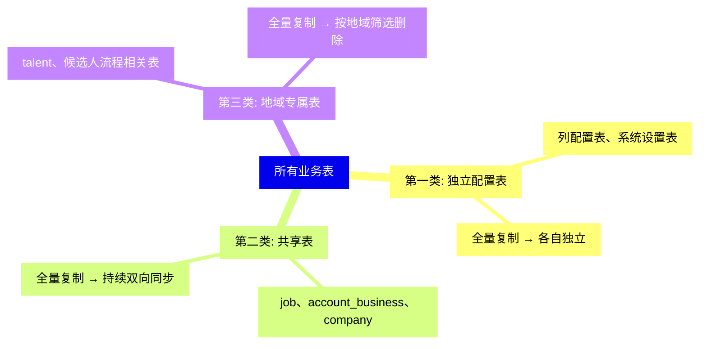
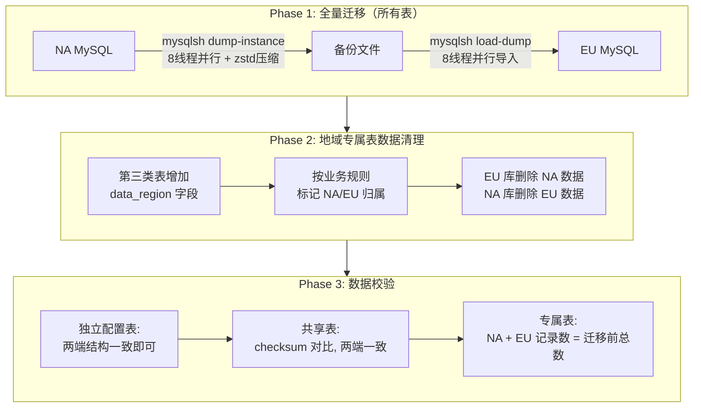

# MySQL 数据迁移方案

> NA → EU 初始数据迁移 | MySQL Shell + 分类迁移脚本

---

## 1. 三类表分类

| 类型 | 说明 | 代表表 | 迁移策略 |
|------|------|--------|----------|
| **第一类：独立配置表** | 迁移后各自独立，互不影响 | 列配置表、系统设置表 | 全量复制，后续各自独立 |
| **第二类：共享表** | 双向同步，NA/EU 都可创建更新 | job、account_business、company | 全量复制 + 持续双向同步 |
| **第三类：地域专属表** | 按地域拆分，删除对方数据 | talent、候选人流程相关表 | 全量复制 + 按地域筛选删除 |



---

## 2. 迁移三阶段



### Phase 1：全量迁移

```bash
# NA 端导出
mysqlsh -- util dump-instance /backup/full_dump \
  --threads=8 \
  --compression=zstd \
  --excludeSchemas=["mysql","sys","information_schema","performance_schema"]

# EU 端导入
mysqlsh -- util load-dump /backup/full_dump \
  --threads=8 \
  --resetProgress \
  --ignoreExistingObjects=true
```

### Phase 2：地域专属表数据清理

```sql
-- 1. 增加地域标识字段
ALTER TABLE talent ADD COLUMN data_region VARCHAR(4) DEFAULT 'NA';

-- 2. 按业务规则标记数据归属
UPDATE talent SET data_region = 'EU' WHERE <EU识别条件>;

-- 3. 各端删除对方数据
-- EU 库执行：
DELETE FROM talent WHERE data_region = 'NA';
-- NA 库执行：
DELETE FROM talent WHERE data_region = 'EU';
```

### Phase 3：数据校验

```sql
-- 各类表记录数统计
SELECT table_name, COUNT(*) FROM information_schema.tables
WHERE table_schema = 'apn' GROUP BY table_name;
```

| 校验维度 | 预期结果 |
|----------|----------|
| 第一类：独立配置表 | 两端表结构一致 |
| 第二类：共享表 | checksum 对比，两端数据完全一致 |
| 第三类：地域专属表 | NA 记录数 + EU 记录数 = 迁移前总数 |

---

## 3. 技术选型：MySQL Shell vs mysqldump

| 维度 | MySQL Shell | mysqldump |
|------|-------------|-----------|
| 导出方式 | 多线程并行（8+线程） | 单线程串行 |
| 压缩 | 原生 zstd（体积降 70%+） | 需外部 gzip |
| 断点续传 | 支持 | 不支持 |
| 导入速度 | 多线程并行 LOAD DATA | 单线程逐条 INSERT |
| MySQL 8.0+ 兼容 | 原生支持 | 支持 |

> **结论**：MySQL Shell 在大数据量场景下速度提升 **5~10 倍**，且支持断点续传，是生产级迁移的推荐工具。
